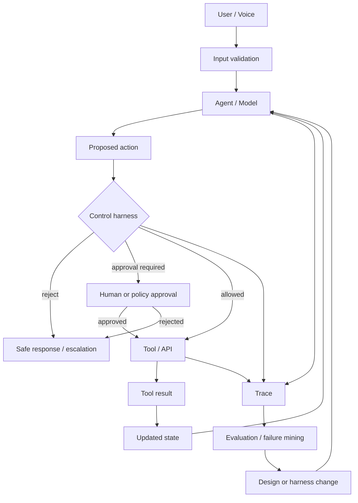

# Agent Harness: The Control Plane Around the Model

**Estimated reading time:** 15 minutes · **Facts checked:** October 7, 2026

The model is not the system.

An agent harness is the runtime and application layer around a model that determines what
the model can see, what it can propose, what it is allowed to execute, how execution
continues, and how the run is observed and evaluated.

Microsoft now uses "agent harness" as an explicit runtime concept, defined as "the runtime
scaffolding that turns a language model into an agent that can perform work" [1]; OpenAI
exposes guardrails, human review, sessions, tools, handoffs, and tracing as SDK primitives
[3][4][5]. The reference design below combines those ideas with the control principles
already used in this repository (lab 02's guarded tool dispatcher and
[whitepaper chapter 15, section 9](whitepaper/15-agentic-orchestration.md)). It is this
repo's synthesis, not any vendor's or ServiceTitan's design.

## 1. Canonical control loop



The important property is the **authority boundary**:

> The model proposes. The harness decides whether and how the proposal becomes a side
> effect.

A model should not be the final authority over permissions, idempotency, business
invariants, or irreversible actions.

## 2. Typical harness components

| Component | Responsibility | Typical implementation |
|---|---|---|
| Input validation | reject malformed or disallowed requests | schema/content checks |
| Authentication | establish caller identity | identity service / token |
| Context builder | assemble relevant state | typed state + retrieval |
| Policy engine | decide what is permitted | deterministic rules / policy service |
| Permission check | enforce user/agent authority | RBAC/ABAC |
| Schema validation | validate tool arguments/results | typed schemas |
| State validation | prevent stale/conflicting actions | version/ETag/state checks |
| Arbitration | choose among competing proposals | deterministic score/rules |
| Idempotency | prevent duplicate side effects | operation IDs / idempotent APIs |
| Risk classifier | identify actions requiring stronger controls | rules or classifier |
| HITL | pause before high-risk side effects | approval queue/UI |
| Rate limits | bound runaway execution | quotas / iteration limits |
| Retry/timeout | handle transient failures | bounded retry + backoff |
| Circuit breaker | stop cascading failures | failure-rate thresholds |
| Trace | reconstruct what happened | spans/events |
| Evaluation hook | turn behavior into measurable tests | graders/eval datasets |

Not every system needs every component. The engineering task is to identify which controls
are required by the failure cost.

## 3. RAG, state, memory, tools, and guardrails are different

These terms are often collapsed into "context." They solve different problems.

```text
                  AGENT
                    |
       +------------+-------------+
       |            |             |
       v            v             v
     RAG          STATE          TOOLS
  "what facts     "what the      "what can
   should I       system knows   I do?"
   retrieve?"     now"
       |            |             |
       +------------+-------------+
                    |
                    v
               PROPOSAL
                    |
                    v
              GUARDRAILS
              "may I do it?"
                    |
                    v
                EXECUTION
```

### RAG

Retrieval-augmented generation is primarily about **selecting information for reasoning**.

Examples:

- retrieve the customer's warranty terms;
- retrieve a technician's service-area policy;
- retrieve the current cancellation policy.

RAG does not itself establish authority to act.

### State

State is the system's authoritative representation of what is currently known:

- customer ID;
- job ID;
- appointment status;
- selected slot;
- approval state;
- version number.

State should be typed, versioned, and have provenance where correctness matters.

### Memory

Memory answers a different question:

> What information should persist across interactions?

A conversation summary or learned preference can be memory. It should not automatically
be treated as authoritative business state.

### Tools

Tools cross a system boundary:

- `get_customer`;
- `check_capacity`;
- `book_appointment`;
- `cancel_appointment`.

Tool schemas constrain syntax. They do not necessarily establish business authorization.

### Guardrails

Guardrails answer:

> Is this input, output, or tool operation permitted?

OpenAI's current guidance distinguishes input, output, and tool guardrails and recommends
human approval for sensitive side effects [4].

## 4. The side-effect boundary

A useful design rule is to place the strongest controls **before the irreversible action**.

```text
                 model
                   |
             "book 10:00"
                   |
                   v
          +-------------------+
          | validate proposal |
          +---------+---------+
                    |
          +---------+---------+
          |                   |
       reject              continue
                              |
                              v
                    permission check
                              |
                              v
                    state/version check
                              |
                              v
                       risk decision
                         /       \
                      HITL       safe
                       |          |
                       +----+-----+
                            |
                            v
                     idempotent API
                            |
                            v
                       side effect
```

A guardrail that only checks the final natural-language response is too late if the
agent already called a tool that changed production state.

## 5. Deterministic controls versus model controls

A useful rule:

| Decision | Prefer |
|---|---|
| "Is this JSON valid?" | deterministic code |
| "Does this user have permission?" | deterministic authorization |
| "Is this appointment version current?" | deterministic state check |
| "Have we already executed this operation?" | idempotency store |
| "Which of these nuanced requests best matches intent?" | model |
| "Which candidate has highest business value?" | model may propose; deterministic policy should arbitrate |
| "Should this irreversible action require approval?" | policy/risk layer |
| "Is the response helpful?" | evaluator/model judge can score |
| "What should happen after a timeout?" | deterministic workflow |

This is the practical meaning of **model proposes, harness controls**.

## 6. Harnesses can be thin or thick

### Thin harness

```text
Agent -> schema validation -> tool -> trace
```

Good for low-risk, reversible operations.

### Thick harness

```text
Agent
 |
 v
policy -> permissions -> state -> arbitration -> risk -> HITL
 |
 v
idempotent tool
 |
 v
trace -> outcome -> evaluation
```

Necessary when errors have material business, financial, safety, privacy, or trust cost.

The right question is not "How much guardrail can we add?"

It is:

> **What is the minimum control surface that makes the failure mode acceptable?**

## 7. Harness and workflow are complementary

A workflow controls **execution topology**.

A harness controls **what the agent is allowed to do while executing**.

```text
Workflow:
    Intake -> Eligibility -> Booking -> Confirmation
       |         |            |          |
       +---------+------------+----------+
                         |
                      Harness
               policy / auth / state /
               risk / idempotency
```

Microsoft's Agent Framework is particularly useful here: it documents workflows and the
agent harness as separate concepts [1][2].

## 8. A practical voice-agent harness

For a voice scheduling agent, a reasonable boundary might be:

```text
Caller
  |
  v
Voice runtime
  |
  v
Intent / agent reasoning
  |
  +--> retrieve customer
  |
  +--> check availability
  |
  +--> propose appointment
            |
            v
     CONTROL HARNESS
       |     |     |
       |     |     +--> policy
       |     +--------> authorization
       +--------------> state/version
            |
            +--> cost/risk
            |
            +--> duplicate-operation check
            |
            +--> approval if required
            |
            v
      booking API
            |
            v
       confirmation
            |
            v
      trace + outcome
```

The voice layer should not be granted a direct "do whatever the model says" path to the
booking backend.

## 9. Harness checklist

Before allowing an agent to create a production side effect, answer:

- What identity is acting?
- What state is authoritative?
- What permissions apply?
- What invariants must hold?
- Can the action be repeated safely?
- What happens if the tool times out after committing?
- What happens if state changes between proposal and execution?
- What actions require human approval?
- What is the maximum autonomous loop length?
- What trace lets an engineer reconstruct the decision?
- What evaluation would detect a regression?

## Sources

Checked October 7, 2026.

1. [Microsoft Agent Framework: agent harness](https://learn.microsoft.com/en-us/agent-framework/concepts/harness)
2. [Microsoft Agent Framework overview](https://learn.microsoft.com/en-us/agent-framework/overview/)
3. [OpenAI Agents SDK (Python)](https://openai.github.io/openai-agents-python/)
4. [OpenAI: guardrails and human review](https://developers.openai.com/api/docs/guides/agents/guardrails-approvals)
5. [OpenAI Agents SDK (Python): tracing](https://openai.github.io/openai-agents-python/tracing/)

Related: [comparative agent architectures](comparative-agent-architectures.md),
[design by evaluation](design-by-evaluation.md), [tools and guardrails](tools-and-guardrails.md).
