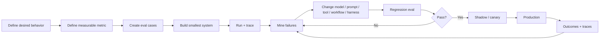

# Design by Evaluation

**Estimated reading time:** 18 minutes · **Facts checked:** October 7, 2026

Evaluation is not the last stage of agent development.

For production agents, the evaluation is part of the **design specification**: it defines
what behavior matters, exposes ambiguous requirements, creates a regression boundary, and
provides evidence for rollout decisions.

Anthropic's guidance separates an agent's transcript (every tool call and intermediate
result) from its outcome (what actually changed), recommends grading the outcome first, and
uses transcripts to check that the graders work [1]. Microsoft Agent Framework includes
evaluators for both agents and workflows [2]. OpenAI's evaluation workflow starts from traces
and graders and moves to repeatable datasets and eval runs [3]. This doc is the repo's
synthesis of those ideas; [whitepaper chapter 15, section 12](whitepaper/15-agentic-orchestration.md)
covers offline and online evaluation and canary releases in more depth.

## 1. The evaluation-first loop



The loop should start **before** implementation.

## 2. Why writing the eval early improves architecture

Suppose the requirement is:

> "Book the earliest acceptable appointment."

That sounds simple until you write the evaluation.

You may discover that "acceptable" means:

- technician skill must match;
- service area must be valid;
- customer requested a time window;
- emergency work has priority;
- travel cannot exceed a threshold;
- a higher-value job may compete for the slot;
- customer consent is required for a changed time;
- duplicate booking must never occur.

Those are not merely test cases. They are **architecture requirements**.

The eval forces the team to identify:

```text
Requirement
    |
    v
Observable behavior
    |
    v
Required state
    |
    v
Required tools
    |
    v
Policy / control boundary
    |
    v
Evaluation
```

## 3. Four layers of evaluation

A useful hierarchy is:

| Layer | Question | Example |
|---|---|---|
| Model | Did the model reason correctly? | correct intent |
| Agent | Did the agent choose the right action? | correct tool |
| Workflow | Did the system execute correctly? | correct handoff |
| Business | Did the outcome help? | valid booking, no dispatch conflict |

Do not stop at model quality.

A model can have excellent language quality while an agent makes the wrong tool call.
An agent can make the right tool call while the workflow supplies stale state.
The workflow can succeed technically while producing a poor business outcome.

## 4. Grade the outcome; inspect the trajectory

For a multi-step agent, the final response is only one observation, and it can be wrong
about itself: an agent can say "you're booked" when no job exists. Grade the **outcome**
first, meaning the state the agent left behind (does a valid job exist for this customer, in
this slot, exactly once?) [1]. Then use the trajectory for two things: checking steps that
are themselves policy, and explaining failures.

```text
Input
  |
  v
Agent
  |
  +--> tool A
  |      |
  |      v
  |    result
  |
  +--> tool B
  |      |
  |      v
  |    result
  |
  +--> retry
  |
  v
Final answer
```

Trajectory checks are worth writing where a step is policy or a known failure mechanism:

- Was the right tool selected?
- Were arguments valid?
- Did the agent use the returned result?
- Did it retry appropriately?
- Did it stop when the objective was satisfied?
- Did it violate a policy before recovering?
- Did it create unnecessary tool calls?
- Did it reach the right result for the right reason?

Avoid grading the exact sequence of steps when several paths are valid; that rewards one
script and fails correct alternatives [1].

OpenAI's trace-evaluation guidance uses traces, the "end-to-end record of model calls, tool
calls, guardrails, and handoffs for one run," as the starting point for grading [3].
Microsoft exposes evaluators for tool selection, tool input accuracy, task completion,
safety, and workflow evaluation [2].

## 5. Build the evaluation matrix before the implementation

For a voice booking capability:

| Dimension | Example criterion | Failure severity |
|---|---|---|
| Intent | identifies booking vs cancellation | medium |
| Identity | links to correct customer | high |
| Eligibility | respects service constraints | high |
| Retrieval | obtains current availability | high |
| Tool choice | uses booking tool only after checks | high |
| Tool args | passes correct customer/job/slot | critical |
| Policy | rejects disallowed booking | critical |
| State | uses current appointment version | critical |
| Idempotency | duplicate call does not duplicate booking | critical |
| Conversation | confirms important details | medium |
| Latency | meets p95 target | medium |
| Outcome | appointment is actually valid | critical |
| Escalation | defers when confidence/policy requires | high |

This table can become the test plan, instrumentation plan, and design-review agenda.

## 6. Finding failures in production

Failure mining (section 7) needs failures to mine, and the worst ones don't announce
themselves. An agent that says "you're booked" when no job exists reports success. A caller
who gives up rarely files a complaint. The quiet failures are the expensive ones, so finding
them has to be designed in, not left to whoever happens to notice.

### Where the signals come from

No single signal finds everything. Use several, because each sees a different kind of failure:

| Signal source | Examples | What it tends to catch |
|---|---|---|
| **Words vs. the record** | agent said "booked" but no job exists; job created twice; slot differs from the one read back | claim grounding, idempotency, stale state |
| **What happened next** | caller rings back within 24 hours; booking cancelled or rescheduled within a day; no-show; wrong technician type dispatched | wrong intent, wrong job type, consent problems |
| **Caller behavior on the call** | hang-up mid-flow; "let me talk to a person"; repeated corrections; long silences; frequent barge-in | turn-taking, ASR errors, confusing prompts |
| **Human corrections** | a CSR edits or reverses an agent booking; a dispatcher moves it | the errors people catch silently every day |
| **Operational telemetry** | tool errors, retries and timeouts; escalation rate; latency tail (p95/p99) | integration and infrastructure failures |
| **Graders and judges** | bookability judge disagrees with the booking outcome; low-confidence critical fields | denominator and extraction errors |
| **Drift** | the call mix shifts (heat wave, new trade, new market) | everything above, concentrated in the new traffic |

The first row is the cheapest high-value check you can run: compare what the agent **said**
with what the **system of record** shows, call by call. It needs no model and no human, and it
catches the failures the agent itself will never report. (The
[claims-vs-state lesson](https://sp7412.github.io/onboarding/lessons/claims-vs-state/) and
labs 07 and 13 build this check.)

### Sample two ways, for two purposes

You can't review every call, and the two reasons to review calls need different samples:

- **A random sample estimates rates.** Review a small uniform sample every week. It is the
  only unbiased estimate of how often failures happen, and it finds failure types that no
  signal is watching for yet.
- **Targeted samples find mechanisms.** Pull the calls the signals flagged, and over-sample
  rare, high-cost segments (emergencies, new trades, new markets). These find *why* things
  fail quickly, but they can't tell you *how often*, because they were chosen for looking bad.

Keep them labelled separately. A failure rate computed from flagged calls is wrong by
construction, and the same denominator discipline from the
[denominator lesson](https://sp7412.github.io/onboarding/lessons/denominator/) applies.

### A signal is not a failure

Treat every signal as a candidate, then confirm it:

```text
signal fires --> candidate call --> read transcript + state + trace --> confirmed?
                                                                          |
                         no: record as a false alarm (tune the signal) <--+
                         yes: classify the mechanism (section 7), score severity x frequency
```

Two habits keep the signals honest:

- **Measure each signal's precision.** Of the calls a signal flagged, how many were real
  failures? A signal that is right 5% of the time wastes reviewers; fix it or drop it.
- **Distrust a quiet dashboard.** Zero flagged calls can mean zero failures, or a broken
  logging path, a renamed event, or a signal that no longer fires. Seed a known-bad test call
  through production occasionally and check that it is caught.

### Voice-specific traps

- **Heard vs. transcribed.** A "reasoning" failure is often a speech-recognition error: the
  model answered the transcript correctly, and the transcript was wrong. Listen to the audio
  before blaming the model.
- **Heard vs. generated.** After a barge-in, the caller heard only part of what the agent
  generated. Judge the conversation by what the caller heard (the
  [heard-vs-generated lesson](https://sp7412.github.io/onboarding/lessons/heard-vs-generated/)).
- **Turn-taking shows up as behavior.** Talk-overs, cut-offs and long silences rarely appear
  in the transcript as errors; they appear as hang-ups and repeated corrections.

### Make it a routine

Failure finding works when it is a habit with an owner, not a project:

1. Weekly: review the random sample and the top flagged clusters.
2. Name the mechanism for each confirmed failure, not just the symptom.
3. Pick the top few clusters by severity × frequency and turn each into eval cases
   (section 7).
4. Track each signal's precision, and add a signal for every new failure type found only by
   the random sample.

Anthropic's eval guidance makes the same point about reading: you won't know whether your
graders work unless you read transcripts and grades from many trials [1]. OpenAI's guidance
starts from traces, which record the model calls, tool calls, guardrails and handoffs of each
run [3]. [Whitepaper chapter 15, section 11](whitepaper/15-agentic-orchestration.md) works a
"wrong technician" investigation end to end.

The specific signals, thresholds and review rituals at any company are team decisions. Ask
about them rather than assume; the
[question bank](first-90-days-question-bank.md#production-operations) has starting points.

## 7. Failure mining creates new evals

Production failures should feed the dataset.

```text
Production trace
      |
      v
Failure detected
      |
      v
Classify failure
      |
      +--> reasoning
      +--> retrieval
      +--> tool selection
      +--> tool args
      +--> stale state
      +--> policy
      +--> integration
      |
      v
Redacted regression case
      |
      v
Evaluation dataset
      |
      v
New implementation
      |
      v
Regression run
```

The key is to preserve the **failure mechanism**, not merely the final text.

A bad booking should become a test that captures why it was bad: stale capacity, wrong
technician, incorrect tool argument, policy violation, or something else.

## 8. Evaluation changes architecture

An evaluation can tell you that a problem is not a model problem.

For example:

**Observation:** the agent chooses the correct appointment 99% of the time in a static
dataset but duplicates bookings under retries.

**Conclusion:** more prompt tuning is unlikely to solve the primary failure.

**Architecture change:** add idempotency to the execution harness.

Another example:

**Observation:** the agent succeeds overall, but performance collapses when the customer's
requested window conflicts with technician capacity.

**Architecture change:** promote capacity and constraints into authoritative shared state
and make arbitration explicit.

Thus:

> **A good evaluation does not merely score the architecture. It tells you what architecture
> you need.**

## 9. Evaluation and rollout

Evaluation should be connected to release controls:

```text
Offline eval
    |
    v
Regression gate
    |
    v
Shadow traffic
    |
    v
1% canary
    |
    v
10% / 25% / 50%
    |
    v
100%
```

At each stage monitor both quality and guardrails.

Examples:

- wrong-action rate;
- escalation rate;
- tool failure rate;
- duplicate side effects;
- latency;
- cost;
- customer effort;
- business outcome.

A candidate that improves task completion but increases critical side effects should not
be promoted.

## 10. The design-review questions

Before implementation, ask:

1. What behavior are we trying to change?
2. Who is the eligible population?
3. What is the denominator?
4. What counts as success?
5. What counts as a critical failure?
6. What intermediate behavior matters?
7. What state must be authoritative?
8. What tools are required?
9. What actions need deterministic controls?
10. What requires HITL?
11. How will traces expose failures?
12. What evaluation detects regression?
13. What rollout evidence permits promotion?
14. What evidence causes rollback?

If these cannot be answered, the design is probably underspecified.

## 11. The core mental model

Do not think:

> Build agent → test agent → deploy agent.

Think:

> **Define behavior → define evidence → design system → build → trace → evaluate → learn.**

That is **design by evaluation**.

## Sources

Checked October 7, 2026.

1. [Anthropic: Demystifying evals for AI agents (January 9, 2026)](https://www.anthropic.com/engineering/demystifying-evals-for-ai-agents)
2. [Microsoft Agent Framework: evaluation](https://learn.microsoft.com/agent-framework/agents/evaluation)
3. [OpenAI: evaluate agent workflows](https://developers.openai.com/api/docs/guides/agent-evals)

Related: [evaluating voice agents](evaluating-voice-agents.md), [earning autonomy](earning-autonomy.md),
[agent harness](agent-harness.md), [comparative agent architectures](comparative-agent-architectures.md).
