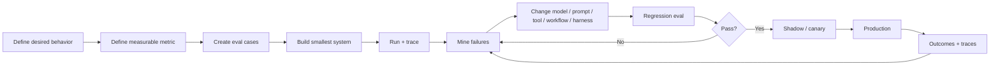

# Design by Evaluation

**Estimated reading time:** 12 minutes · **Facts checked:** October 7, 2026

Evaluation is not the last stage of agent development.

For production agents, the evaluation is part of the **design specification**: it defines
what behavior matters, exposes ambiguous requirements, creates a regression boundary, and
provides evidence for rollout decisions.

Anthropic's current guidance emphasizes that agent evals must account for multi-step behavior
and intermediate results. Microsoft Agent Framework includes evaluation for both agents and
workflows. OpenAI's evaluation workflow starts from traces and graders and turns observed
behavior into reusable evaluation data.

## 1. The evaluation-first loop



The loop should start **before** implementation.

## 2. Why writing the eval early improves architecture

Suppose the requirement is:

> "Book the earliest acceptable appointment."

That sounds simple until you write the evaluation.

You may discover that "acceptable" means:

- technician skill must match;
- service area must be valid;
- customer requested a time window;
- emergency work has priority;
- travel cannot exceed a threshold;
- a higher-value job may compete for the slot;
- customer consent is required for a changed time;
- duplicate booking must never occur.

Those are not merely test cases. They are **architecture requirements**.

The eval forces the team to identify:

```text
Requirement
    |
    v
Observable behavior
    |
    v
Required state
    |
    v
Required tools
    |
    v
Policy / control boundary
    |
    v
Evaluation
```

## 3. Four layers of evaluation

A useful hierarchy is:

| Layer | Question | Example |
|---|---|---|
| Model | Did the model reason correctly? | correct intent |
| Agent | Did the agent choose the right action? | correct tool |
| Workflow | Did the system execute correctly? | correct handoff |
| Business | Did the outcome help? | valid booking, no dispatch conflict |

Do not stop at model quality.

A model can have excellent language quality while an agent makes the wrong tool call.
An agent can make the right tool call while the workflow supplies stale state.
The workflow can succeed technically while producing a poor business outcome.

## 4. Evaluate trajectories, not only answers

For a multi-step agent, the final response is only one observation.

```text
Input
  |
  v
Agent
  |
  +--> tool A
  |      |
  |      v
  |    result
  |
  +--> tool B
  |      |
  |      v
  |    result
  |
  +--> retry
  |
  v
Final answer
```

A trajectory-aware eval can ask:

- Was the right tool selected?
- Were arguments valid?
- Did the agent use the returned result?
- Did it retry appropriately?
- Did it stop when the objective was satisfied?
- Did it violate a policy before recovering?
- Did it create unnecessary tool calls?
- Did it reach the right result for the right reason?

OpenAI's trace-evaluation guidance explicitly uses traces containing model calls, tool
calls, guardrails, and handoffs as the starting point for grading. Microsoft exposes
evaluators for tool selection, tool arguments, task completion, safety, and workflow
evaluation.

## 5. Build the evaluation matrix before the implementation

For a voice booking capability:

| Dimension | Example criterion | Failure severity |
|---|---|---|
| Intent | identifies booking vs cancellation | medium |
| Identity | links to correct customer | high |
| Eligibility | respects service constraints | high |
| Retrieval | obtains current availability | high |
| Tool choice | uses booking tool only after checks | high |
| Tool args | passes correct customer/job/slot | critical |
| Policy | rejects disallowed booking | critical |
| State | uses current appointment version | critical |
| Idempotency | duplicate call does not duplicate booking | critical |
| Conversation | confirms important details | medium |
| Latency | meets p95 target | medium |
| Outcome | appointment is actually valid | critical |
| Escalation | defers when confidence/policy requires | high |

This table can become the test plan, instrumentation plan, and design-review agenda.

## 6. Failure mining creates new evals

Production failures should feed the dataset.

```text
Production trace
      |
      v
Failure detected
      |
      v
Classify failure
      |
      +--> reasoning
      +--> retrieval
      +--> tool selection
      +--> tool args
      +--> stale state
      +--> policy
      +--> integration
      |
      v
Redacted regression case
      |
      v
Evaluation dataset
      |
      v
New implementation
      |
      v
Regression run
```

The key is to preserve the **failure mechanism**, not merely the final text.

A bad booking should become a test that captures why it was bad: stale capacity, wrong
technician, incorrect tool argument, policy violation, or something else.

## 7. Evaluation changes architecture

An evaluation can tell you that a problem is not a model problem.

For example:

**Observation:** the agent chooses the correct appointment 99% of the time in a static
dataset but duplicates bookings under retries.

**Conclusion:** more prompt tuning is unlikely to solve the primary failure.

**Architecture change:** add idempotency to the execution harness.

Another example:

**Observation:** the agent succeeds overall, but performance collapses when the customer's
requested window conflicts with technician capacity.

**Architecture change:** promote capacity and constraints into authoritative shared state
and make arbitration explicit.

Thus:

> **A good evaluation does not merely score the architecture. It tells you what architecture
> you need.**

## 8. Evaluation and rollout

Evaluation should be connected to release controls:

```text
Offline eval
    |
    v
Regression gate
    |
    v
Shadow traffic
    |
    v
1% canary
    |
    v
10% / 25% / 50%
    |
    v
100%
```

At each stage monitor both quality and guardrails.

Examples:

- wrong-action rate;
- escalation rate;
- tool failure rate;
- duplicate side effects;
- latency;
- cost;
- customer effort;
- business outcome.

A candidate that improves task completion but increases critical side effects should not
be promoted.

## 9. The design-review questions

Before implementation, ask:

1. What behavior are we trying to change?
2. Who is the eligible population?
3. What is the denominator?
4. What counts as success?
5. What counts as a critical failure?
6. What intermediate behavior matters?
7. What state must be authoritative?
8. What tools are required?
9. What actions need deterministic controls?
10. What requires HITL?
11. How will traces expose failures?
12. What evaluation detects regression?
13. What rollout evidence permits promotion?
14. What evidence causes rollback?

If these cannot be answered, the design is probably underspecified.

## 10. The core mental model

Do not think:

> Build agent → test agent → deploy agent.

Think:

> **Define behavior → define evidence → design system → build → trace → evaluate → learn.**

That is **design by evaluation**.

## Sources

1. [Anthropic — Demystifying evals for AI agents](https://www.anthropic.com/engineering/demystifying-evals-for-ai-agents)
2. [Microsoft Agent Framework evaluation](https://learn.microsoft.com/agent-framework/agents/evaluation)
3. [Microsoft Agent Framework overview](https://learn.microsoft.com/en-us/agent-framework/overview/)
4. [OpenAI — Evaluate agent workflows](https://developers.openai.com/api/docs/guides/agent-evals)
5. [OpenAI — Agents SDK](https://openai.github.io/openai-agents-python/)
