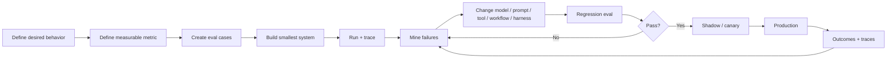

# Design by Evaluation

**Estimated reading time:** 16 minutes · **Facts checked:** October 7, 2026

Evaluation is not the last stage of agent development.

For production agents, the evaluation is part of the **design specification**: it defines what behavior matters, exposes ambiguous requirements, creates a regression boundary, and provides evidence for rollout decisions.

## 1. The evaluation-first loop



The loop should start **before** implementation.

## 2. Why writing the eval early improves architecture

Suppose the requirement is:

> "Book the earliest acceptable appointment."

Writing the evaluation exposes architecture requirements: technician skill, service area, requested time window, emergency priority, travel constraints, competing jobs, customer consent, and duplicate-booking prevention.

```text
Requirement
    |
    v
Observable behavior
    |
    v
Required state
    |
    v
Required tools
    |
    v
Policy / control boundary
    |
    v
Evaluation
```

## 3. Four layers of evaluation

| Layer | Question | Example |
|---|---|---|
| Model | Did the model reason correctly? | correct intent |
| Agent | Did the agent choose the right action? | correct tool |
| Workflow | Did the system execute correctly? | correct handoff |
| Business | Did the outcome help? | valid booking, no dispatch conflict |

Do not stop at model quality. A model can be linguistically excellent while the agent makes the wrong tool call, the workflow supplies stale state, or the technically successful workflow produces a poor business outcome.

## 4. Grade the outcome; inspect the trajectory

For a multi-step agent, the final response is only one observation. Grade the **outcome** first: what authoritative state did the agent leave behind? Then inspect the trajectory for policy compliance and failure diagnosis.

```text
Input
  |
  v
Agent
  |
  +--> tool A --> result
  |
  +--> tool B --> result
  |
  +--> retry
  |
  v
Final answer
```

Useful trajectory checks include tool selection, argument validity, use of returned results, retry behavior, stopping behavior, policy violations, unnecessary calls, and whether the agent reached the result through an acceptable path.

Avoid grading one exact sequence when several paths are valid.

## 5. Build the evaluation matrix before implementation

For a voice booking capability:

| Dimension | Example criterion | Failure severity |
|---|---|---|
| Intent | identifies booking vs cancellation | medium |
| Identity | links to correct customer | high |
| Eligibility | respects service constraints | high |
| Retrieval | obtains current availability | high |
| Tool choice | uses booking tool only after checks | high |
| Tool args | passes correct customer/job/slot | critical |
| Policy | rejects disallowed booking | critical |
| State | uses current appointment version | critical |
| Idempotency | duplicate call does not duplicate booking | critical |
| Conversation | confirms important details | medium |
| Latency | meets p95 target | medium |
| Outcome | appointment is actually valid | critical |
| Escalation | defers when confidence/policy requires | high |

This table can become the test plan, instrumentation plan, and design-review agenda.

## 6. Finding failures in production

A production agent does not hand you a labeled dataset. You need **failure discovery**.

Combine three evidence sources:

```text
                    PRODUCTION
                       |
          +------------+------------+
          |            |            |
          v            v            v
   Deterministic    Business      Trace
      signals        outcomes     analysis
          |            |            |
          +------------+------------+
                       |
                       v
                Suspicious runs
                       |
                       v
              Judge + human review
                       |
                       v
                Failure taxonomy
                       |
                       v
              Regression eval case
```

### Deterministic signals

Start with signals that do not require an LLM:

- tool/API errors;
- invalid tool arguments;
- duplicate operations;
- policy violations;
- authorization failures;
- retries/timeouts;
- circuit-breaker trips;
- unexpected handoffs;
- unusually long trajectories;
- state/version conflicts;
- downstream corrections or reversals.

These are cheap, reproducible, and often high precision.

### Business outcome signals

The business system is often the best oracle. For a booking agent, mine cases such as a booking later canceled because it was invalid, a CSR correcting an agent action, a customer calling back after an apparent success, a reschedule shortly afterward, a service-constraint violation, or a downstream dispatch conflict.

**Use authoritative business state to determine whether an outcome actually happened.** Do not ask an LLM whether a booking exists when the booking system can answer that deterministically.

### Statistical and cohort-based mining

Look for changes and outliers:

- error rate by agent/model/prompt version;
- tool failure rate by tool version;
- escalation rate by intent;
- latency p95/p99;
- failure rate by customer/job cohort;
- geography, language, channel, or time;
- new failure modes after deployment;
- disagreement between agents and downstream systems.

A useful query is:

```text
Find cohorts where:
    candidate outcome_error_rate
        >
    control outcome_error_rate
```

Then retrieve traces from those cohorts.

## 7. LLM-as-judge

An LLM judge is useful when the property is difficult to encode deterministically:

- Was the customer's request actually satisfied?
- Was the escalation appropriate?
- Did the agent follow the conversational objective?
- Was the response clear and grounded in available evidence?

```text
Production trace
      |
      v
  Judge rubric
      |
      v
  score + rationale
      |
      +--> pass
      +--> fail
      +--> uncertain
                |
                v
           Human review
```

### The judge is not ground truth

**LLM-as-judge is a scalable detector/evaluator, not an authoritative oracle.**

| Question | Preferred oracle |
|---|---|
| Does a booking exist? | authoritative booking DB |
| Was the slot actually available? | scheduling system |
| Was the tool schema valid? | deterministic validator |
| Was the customer's intent satisfied? | LLM judge + sampled human labels |
| Was the conversation clear? | LLM judge + human calibration |
| Did the agent violate a policy? | deterministic policy check where possible |

Use the strongest available oracle first.

### Judge calibration

Before trusting a judge at production scale, create a human-labeled **gold set**.

```text
Random / stratified production sample
                |
                v
          Human labels
                |
                v
             Gold set
                |
          +-----+-----+
          |           |
          v           v
       LLM judge  Deterministic checks
          |           |
          +-----+-----+
                |
                v
       precision / recall /
       agreement / bias
                |
                v
          tune rubric
```

Measure the judge against humans where human judgment is genuinely required. Pay particular attention to false negatives on critical failures, reviewer overload from false positives, systematic cohort/language disagreement, sensitivity to irrelevant wording, and instability across judge-model versions.

Keep human review for high-impact, uncertain, or novel failures.

## 8. Production failure mining → eval dataset

The complete workflow:

```text
                 PRODUCTION RUN
                       |
                       v
               Structured trace
                       |
          +------------+------------+
          |            |            |
          v            v            v
      Outcome       Metrics      LLM judge
       oracle       / alerts     / sampling
          |            |            |
          +------------+------------+
                       |
                       v
                 Candidate failure
                       |
                       v
                Human validation
                       |
                       v
                 Failure taxonomy
                       |
                       v
             Redacted regression case
                       |
                       v
                 Eval dataset
                       |
                       v
               New implementation
                       |
                       v
                 Regression run
                       |
                       v
                  Canary / shadow
                       |
                       +------> production
```

Preserve the **failure mechanism**, not merely the final text. A bad booking should become a test capturing whether the cause was stale capacity, wrong technician, incorrect tool arguments, policy violation, duplicate execution, or another mechanism.

## 9. Failure taxonomy

| Category | Example | Likely fix |
|---|---|---|
| Reasoning | chose wrong interpretation | model/prompt/eval |
| Retrieval | retrieved stale policy | RAG/state |
| Tool selection | called wrong API | agent/tool design |
| Tool args | wrong customer ID | schema/state/harness |
| State | used stale appointment | state/versioning |
| Policy | unauthorized action | deterministic guardrail |
| Arbitration | locally good, globally bad action | orchestration |
| Integration | timeout/partial failure | workflow/retry/idempotency |
| Recovery | failed to recover correctly | workflow/harness |
| Business outcome | technically succeeded, bad result | product/system design |

This classification prevents the team from treating every failure as "the model needs better prompting."

## 10. Evaluation changes architecture

**Observation:** the agent chooses the correct appointment 99% of the time in a static dataset but duplicates bookings under retries.

**Conclusion:** more prompt tuning is unlikely to solve the primary failure.

**Architecture change:** add idempotency to the execution harness.

**Observation:** performance collapses when the customer's requested window conflicts with technician capacity.

**Architecture change:** promote capacity and constraints into authoritative shared state and make arbitration explicit.

> **A good evaluation does not merely score the architecture. It tells you what architecture you need.**

## 11. Evaluation and rollout

```text
Offline eval
    |
    v
Regression gate
    |
    v
Shadow traffic
    |
    v
1% canary
    |
    v
10% / 25% / 50%
    |
    v
100%
```

At each stage monitor quality and guardrails: wrong-action rate, escalation, tool failures, duplicate side effects, latency, cost, customer effort, and business outcome.

A candidate that improves task completion but increases critical side effects should not be promoted.

## 12. Design-review questions

1. What behavior are we trying to change?
2. Who is the eligible population?
3. What is the denominator?
4. What counts as success?
5. What counts as a critical failure?
6. What intermediate behavior matters?
7. What state must be authoritative?
8. What tools are required?
9. What actions need deterministic controls?
10. What requires HITL?
11. How will traces expose failures?
12. What deterministic production signals can detect failures?
13. What business outcomes can act as an oracle?
14. Where is LLM-as-judge appropriate?
15. How will the judge be calibrated?
16. What evaluation detects regression?
17. What rollout evidence permits promotion?
18. What evidence causes rollback?

If these cannot be answered, the design is probably underspecified.

## 13. Core mental model

Do not think:

> Build agent → test agent → deploy agent.

Think:

> **Define behavior → define evidence → design system → build → trace → evaluate → learn.**

And in production:

> **Observe outcomes → mine suspicious trajectories → validate failures → turn failures into evals → prevent recurrence.**

That is **design by evaluation**.

## Sources

Checked October 7, 2026.

1. [Anthropic: Demystifying evals for AI agents](https://www.anthropic.com/engineering/demystifying-evals-for-ai-agents)
2. [Microsoft Agent Framework: evaluation](https://learn.microsoft.com/agent-framework/agents/evaluation)
3. [OpenAI: evaluate agent workflows](https://developers.openai.com/api/docs/guides/agent-evals)

Related: [evaluating voice agents](evaluating-voice-agents.md), [earning autonomy](earning-autonomy.md), [agent harness](agent-harness.md), [comparative agent architectures](comparative-agent-architectures.md).
