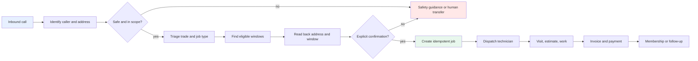

# How A Contractor Works

This is a simplified, fictional workflow for learning. Individual contractors differ
by trade, geography, staffing, pricing, and operating policy.

## The Job Lifecycle

1. **Demand arrives.** A customer calls, submits a web request, or responds to a
   reminder. The office needs enough information to identify the customer and classify
   the request.
2. **Triage happens.** The office determines the trade, urgency, service area, and
   whether the request is safe for routine scheduling. A gas smell, fire, flooding, or
   another hazard may require immediate safety guidance and escalation.
3. **The job is booked.** The scheduler offers eligible windows. The customer confirms
   the address and a window. The system creates one job, safely handling retries.
4. **The job is dispatched.** An office team assigns work based on availability,
   geography, skills, and operating policy. The technician receives the job details.
5. **The visit occurs.** The technician diagnoses the issue, performs authorized work,
   and may prepare an estimate for additional work.
6. **The job is completed.** The business records labor/materials, presents the invoice,
   and collects payment according to its policy.
7. **The relationship continues.** A customer may join or renew a maintenance
   membership, receive reminders, or call again for a related issue.

## Where A Voice Agent Fits

The voice agent is most useful at the front door: answering, identifying, gathering
structured facts, booking eligible work, and transferring calls it should not handle.
It should not become the system of record for customers, schedules, prices, jobs, or
payments. Those actions belong behind authenticated tools and application policy.

## Engineering Questions At Each Boundary

| Boundary | Questions |
|---|---|
| Call to identity | What is authoritative: caller ID, account lookup, or caller-provided information? |
| Triage to safety | Which signals require immediate escalation, and how are false negatives reviewed? |
| Availability to booking | Is the slot still available at commit time? What is the idempotency key? |
| Booking to dispatch | Which facts are required by the field team, and what may be edited later? |
| Visit to invoice | Which decisions are technician-owned, office-owned, or policy-controlled? |
| Completion to retention | Which follow-up is useful, consented, and measurable? |

The fictional backend in `labs/stlab/backend.py` intentionally stops at customers,
slots, and jobs. It is a teaching fixture, not a representation of private systems.
