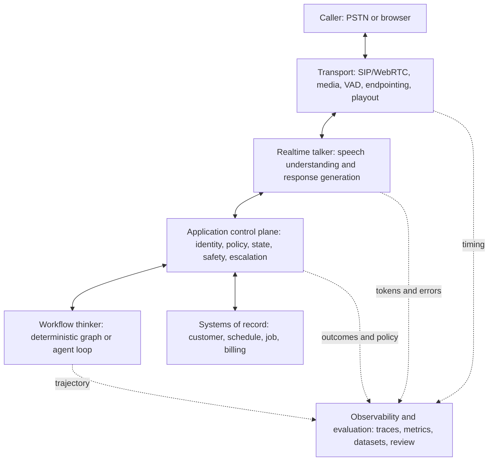
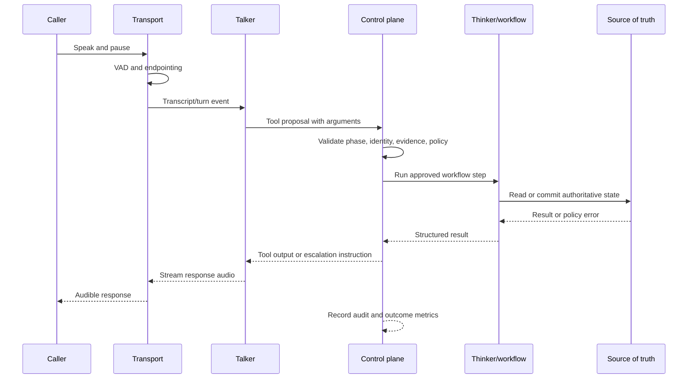
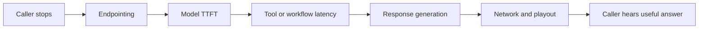
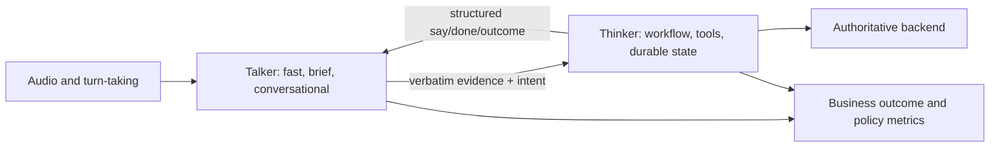

# Voice-Agent Architecture

This is a vendor-neutral reference architecture illustrated with the vendors used in
the labs. The mock backend and simulator are fictional teaching fixtures.

## Reference Architecture

## One Call Turn

## Latency Budget

Treat these as planning categories, not universal targets. Measure p50, p95, and
failure cases in the actual deployment.

The caller experiences the sum. A preamble can reduce perceived dead air, but it does
not make the underlying tool faster. Track separately:

| Segment | Owner | Useful measurement |
|---|---|---|
| End of speech to committed turn | Transport | endpointing delay and premature cutoffs |
| Committed turn to first sound | Talker/model | time to first token or audio |
| Tool proposal to tool result | Control plane/workflow/backend | p50/p95, timeout, retry, policy errors |
| Result to useful answer | Talker | second response latency |
| Stream to caller | Transport | first-byte, buffering, playout interruption |

## Talker And Thinker

The talker should not be trusted as the source of truth. In the capstone, the control
plane passes the transcript evidence to the workflow rather than blindly trusting a
model-paraphrased tool argument. This is analogous to separating a detector from the
authority that decides whether an action is allowed.

## Ownership Rules

- Transport owns media movement, turn boundaries, and local playout state.
- The model owns interpretation and proposed language or tool calls.
- The control plane owns authorization, phase transitions, grounding, idempotency,
  redaction, and escalation policy.
- The workflow owns a durable process, not the system of record itself.
- Observability records what is instrumented; it does not enforce runtime policy.

## Where Each Component Stops

| Component | Owns | Stops at |
|---|---|---|
| LiveKit / transport | Media, rooms, participants, turn handling, interruptions, and session lifecycle | Business rules, source-of-truth state, authorization, and what the agent should do |
| Realtime model | Speech understanding, response generation, context, and proposed tool calls | Tool execution, authoritative facts, durable state, policy enforcement, and knowing exactly what audio was heard |
| LangChain / LangGraph | Model/tool orchestration, middleware, workflow transitions, checkpoints, and interrupts | Audio transport, turn-taking, systems of record, and defining allowed actions |
| LangSmith | Traces, metadata, datasets, evaluators, experiments, and monitoring | Runtime enforcement, uninstrumented audio timing, and deciding what success means |
| Application control plane | Identity, authorization, policy, evidence grounding, phase state, idempotency, safety, escalation, redaction, and outcome definitions | It delegates mechanisms to vendors and decisions to product/compliance owners |

## Latency Worksheet

Fill this in with measured values from the labs or an authorized test environment. The
right-hand values are planning categories, not vendor guarantees.

| Stage | Your measurement | Planning category |
|---|---:|---:|
| End of caller speech → turn committed | | endpointing delay |
| Turn committed → first model audio | | model time to first audio |
| Simple tool round trip | | backend and control-plane latency |
| Multi-step workflow | | off the hot path or masked with filler |
| Network and playout buffering | | transport latency |
| Caller stops → useful answer | | total customer-perceived latency |

The labs provide executable evidence for these boundaries: lab 01 demonstrates
cancellation and truncation, lab 02 blocks an early booking, lab 05 separates context
from state, lab 06 makes confirmation a graph edge, and lab 08 passes verbatim transcript
evidence to the thinker.

See the labs for executable examples.
