# 03 - How A Contractor Works

**Estimated reading time:** 9 minutes · **Facts as of:** September 27, 2026

## Five Takeaways

1. A residential service business runs a loop: demand comes in (mostly by phone), gets
   booked into limited technician capacity, dispatched, worked, invoiced, paid, and turned
   into repeat business through memberships and follow-up.
2. Each step has an owner (CSR, dispatcher, technician, sales advisor, office, owner) and a
   handoff where information gets lost.
3. Booking is a constrained assignment problem: job type, location, required skills,
   arrival windows, buffers and blocked dates all shape what can be offered. [1][2]
4. Revenue per job is decided late (on site, via diagnosis and options), but the chance to
   earn it is decided early, on the call.
5. For a voice agent, every lifecycle step is either a place it reads context or a place
   it changes state, and the state changes are where correctness matters.

## The job lifecycle

The diagram below is a generic teaching model of a residential service call. Real
businesses vary by trade and size.

```mermaid
flowchart LR
    A[Demand: ads, referrals, memberships] --> B[Inbound call, web or text]
    B --> C[Qualify: who, where, what, how urgent]
    C --> D[Offer windows from capacity]
    D --> E[Confirm and book one job]
    E --> F[Dispatch: assign technician]
    F --> G[On site: diagnose, present options]
    G --> H[Do the work or schedule a follow-up]
    H --> I[Invoice and collect payment]
    I --> J[Membership, review, next maintenance visit]
    J --> A
```

**1. Demand.** Leads come from marketing (search, local services ads, direct mail),
referrals, and existing customers, especially members due for maintenance. ServiceTitan's
Core product includes marketing automation, and its Marketing Pro and Google Local Services
Ads integration connect ad spend to booked jobs. [3]

**2. The call.** Most residential demand still arrives by phone. The platform's Call
Booking and Recording feature fills in caller details and shows the CSR property details
and history as the call comes in. [3] Analysis: the first seconds decide whether the caller
waits, books, or calls a competitor.

**3. Qualify.** The CSR (or agent) establishes identity and address, the problem, urgency,
equipment, and whether the job is in the service area and within the business's job types.
Emergencies such as a gas smell take a different path entirely.

**4. Offer windows.** Availability depends on capacity, not just calendar gaps. ServiceTitan's
Scheduling Pro describes availability shaped by buffers, arrival windows and blocked dates,
following the same job types, zones and capacity rules the team uses. [1]

**5. Book.** One job, once: correct customer, location, job type, window and summary.
Analysis: duplicate or phantom bookings are expensive because they consume scarce
technician time or break trust.

**6. Dispatch.** A dispatcher (or dispatch software) assigns a technician. Dispatch Pro
describes matching on technician skills, recent sales performance, location, drive time and
predicted job value. [2] Customers get text notifications when the job is booked and when
the technician is on the way, with a photo and tracking link. [3]

**7. On site.** The technician diagnoses the problem and often presents options from a
pricebook with photos and warranties. [3] Analysis: this is where average ticket is made,
which is why dispatch weighs sales performance, and why booking the *right* job type and
technician matters.

**8. Invoice and payment.** Payments and consumer financing happen through the platform's
FinTech products; payment volume drives part of ServiceTitan's usage revenue. [3]

**9. Retain.** Memberships (maintenance agreements), reviews and follow-ups generate the next
round of demand. Second Chance Leads uses AI to flag unbooked calls worth another attempt. [3]

## Roles and handoffs

| Role | Owns | Typical handoff risk |
|---|---|---|
| CSR / call center | Answering, qualifying, booking | Missing details, wrong job type, over-promising |
| Dispatcher | Assignments, schedule changes | Emergencies and cancellations reshuffle the day |
| Technician | Diagnosis, options, work, notes | Notes missing for the next visit |
| Sales / comfort advisor | Replacement and large-ticket sales | Leads not followed up |
| Office / accounting | Invoicing, payments, memberships | Unbilled work, expired memberships |
| Owner / manager | Pricing, capacity, targets | Decisions based on incomplete data |

Analysis: a voice agent is a new participant in the first two rows. Its handoff to a human
must carry verified identity, address, intent, urgency, what was offered and chosen, and
what the tools actually did.

## Core KPIs

These are common working definitions; each business sets its own, and they should be
agreed internally before comparing numbers.

- **Booking rate:** booked calls ÷ bookable calls (not all calls).
- **Abandonment rate and speed to answer:** calls lost before an answer; Phones Pro reports
  abandonment and call duration. [3]
- **Capacity utilization:** booked technician hours ÷ available hours.
- **Close rate and average ticket:** on-site conversion and revenue per job.
- **Callbacks:** repeat visits to fix the same problem.
- **Membership conversion and renewal.**

## Failure and recovery paths

- **Identity or address uncertain:** confirm, or book as provisional and escalate.
- **No suitable capacity:** offer the next valid window or a callback; never book outside rules.
- **Tool timeout during booking:** retry safely (idempotent), then verify before telling the
  caller anything.
- **Caller changes their mind:** cancel or reschedule with the same checks as booking.
- **Emergency language:** safety instruction, then immediate human escalation.

## What this means for a voice-agent engineer

- Model the lifecycle as **states with invariants** ("a job exists exactly once, in an
  offered window, for a verified customer").
- The agent's value is at steps 2–5; its risk is at step 5 and at every handoff.
- The labs in this repo implement these checks with a mock backend.

## Questions to validate after joining

- What does "booked" mean operationally and in reporting?
- Which lifecycle states can the agent read, propose, change or never touch?
- How do dispatch changes flow back to customers the agent already confirmed?

## Sources

1. ServiceTitan, Scheduling Pro: <https://www.servicetitan.com/features/pro/scheduling>
2. ServiceTitan, Dispatch Pro: <https://www.servicetitan.com/features/pro/dispatch>
3. ServiceTitan Form 10-K, fiscal 2026 (Business section): <https://www.sec.gov/Archives/edgar/data/1638826/000163882626000028/ttan-20260131.htm>
